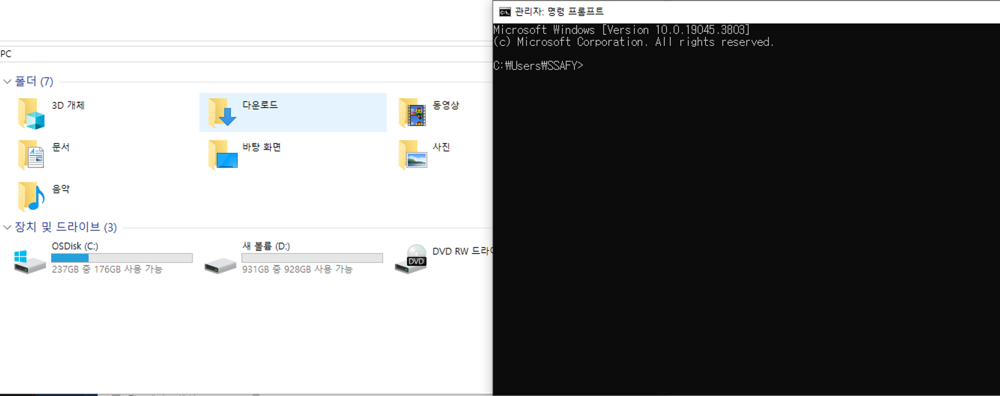

# Markdown

2024년 1월 11일 

기본적으로 노션 사용 방법 또한 마크다운의 일종

https://www.markdownguide.org/basic-syntax/

---

- 일반 텍스트로 문서를 작성하는 간단한 방법
- 주로 개발자들이 텍스트와코드를 작성해 문서화하기 위해 사용
- 확장명: .md

---

## 📌목차
🟡마크다운 활용법
    목록
    Codeblock & Inline code block
    링크 & 이미지
    글씨체
    구분선
    인용법

## 🟡마크다운 활용법

### 목록

- #의 개수에 따라 제목의 수준을 구별
    
    #1개 대제목 / #2개 중제목 / #3개 소제목
    
    #6개까지 가능, 7개부터 안나오는것을 알 수 있음
    
- 목록
    
    n. > 순서가 있는 목록
    
    “-” > 순서가 없는 목록
    
    tab키를 활용해 목록안의 목록을 만들 수 있음
    

### Codeblock & Inline code block

- 일반 텍스트와 달리 해당 프로그래밍 언어에 맞춰서 텍스트 스타일을 변환
    - 개발에서 마크다운을 사용하는 가장 큰 이유
- Codeblock 사용방법
    
    “```프로그래밍 언어
    
    코드…
    
    “```”
    
    - 각 프로그래밍 언어에 맞춰서 색이 변경됨
- Inline code block 사용방법
    
    파이썬에서 출력방법은 “`”print(1)”`”이다
    

### 링크 & 이미지

- 특정 주소를 사용해 다른 페이지로 이동하는 링크 혹은 이미지
- 사용방법
    - 링크: "[구글] (~링크)"
    - 이미지: "![이미지] (~링크)" > 사이즈를 줄이는건 html markdown에서만 가능
    
    
    

### 글씨체

- 굵게 > **  **
- 기울임 > *  *
- 취소선 > "~~"

### 구분선

- "-" * 3

### 인용법

- “>” 사용
