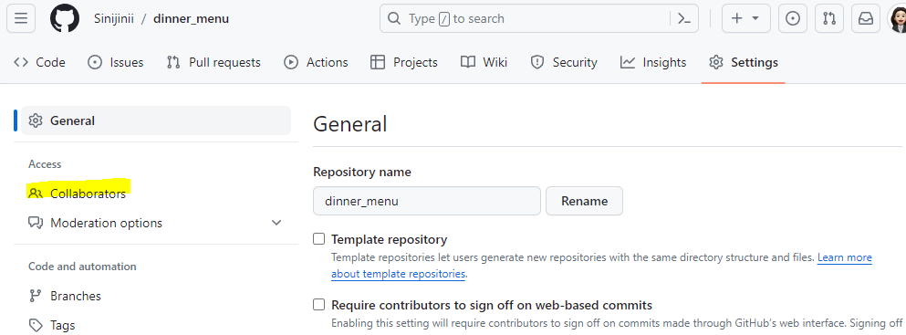

2024년 1월 12일 

---

- 인터넷이나 네트워크 어딘가에 있는 저장소
- 코드와 버전관리 이력을 온라인상의 특정 위치에 저장하여 여러 개발자가 협업하고 코드를 공유할 수 있는 저장 공간
    - GitLab / GitHub / Bitbucket

---

# 📌목차
  🟡로컬 저장소에 원격 저장소 연결
  
    - 원격 저장소 연결 취소
    
  🟡Remote 저장소 업로드
  
    - PULL VS Fetch
    - PUSH / PULL & CLONE
    
  🟡협업을 위한 액세스 권한
  
  🟡gitignore
  
  🟡github 활용하기
  
---

## 🟡로컬 저장소에 원격 저장소 연결

```bash
git remote add origin 저장소 주소
```

- origin은 관례적으로 많이 쓰는 표현/ 굳이 쓰지 않아도 괜찮음

### 원격 저장소 연결 취소

```bash
git remote remove origin
```

---

## 🟡Remote 저장소 업로드

### PULL VS Fetch

- Pull과 Fetch의 차이는 merge처리 여부
    - PULL: 원격 레포지토리부터 최신 커밋들을 내려받아, 현재 로컬 브랜치와 자동으로 병합(merge)
    - Fetch: 원격 레포지토리에서 최신 커밋 코드를 이름 없는 임시 브랜치로 내려받고, 병합(merge)은 진행하지 않음
        - 즉, 개발자가 수동으로 직접 merge를 진행

### PUSH / PULL & CLONE

- PUSH: 내 로컬 디렉토리로부터 커밋 목록을 원격 저장소로 업로드
    
    ```bash
    git push -u origin 브랜치 이름
    ```
    
- PULL: remote 설정이 이미 되어 있었을 때 업데이트 사항을 다운로드를 위해 사용
    - 다른 사람이 원격 저장소(Remote repository)에 업데이트한 파일이 있을 때, 원격저장소와 내 로컬저장소의 상태를 동일하게 만들기 위해 pull을 이용
    - git pull명령은 원격 저장소의 내용을 가져와서 현재 브랜치와 병합(merge)까지 해주기 때문에, 기존에 작업했던 내용은 유지하면서 최신 코드로 업데이트할 수 있는 것
    
    ```bash
    git pull origin
    ```
    

- CLONE:  원격 저장소 전체를 복제(git init이 되어 있는 상태)
    - git clone명령을 사용하면 로컬 저장소의 내용이 원격 저장소의 내용과 일치
    - 프로젝트에 처음 투입될 때 사용되어야 하는 명령
    
    ```bash
    git clone origin
    ```
    
    !https://blog.kakaocdn.net/dn/xHf0m/btr2ufCgtLM/yWrjKBaKCJQPP3bSIWnKv0/img.png
    

---

## 🟡협업을 위한 액세스 권한

설정 > Collaborators > 액세스 관리

※ 해당 저장소의 설정으로 들어가야 함



---

## 🟡gitignore

- Git에서 특정 파일이나 디렉토리를 추적하지 않도록 설정하는데 사용되는 텍스트 파일
- **.gitignore에 정의된 파일은 Staging Area에 올라가지 않기 때문에 tracking 되지 않음**
- git status 를 이용했을 때 보이지 않음
- ※ 한번이라도 git의 관리를 받은 파일은 나중에 gitignore에 작성해도 적용되지 않음

---

## 🟡github 활용하기

- *TIL을 통해 내가 학습하는것 기록 - 문서화
    
    *Today I Learned의 약자
    
    그날그날 내가 공부한 것을 정리하는 것
    
- 개인, 팀 프로젝트 코드 공유
    - 개발 면접 지원시 본인의 github주소를 공유해 어떤 프로젝트를 진행했는지 평가 받음
- 오픈 소스 프로젝트에 기여
